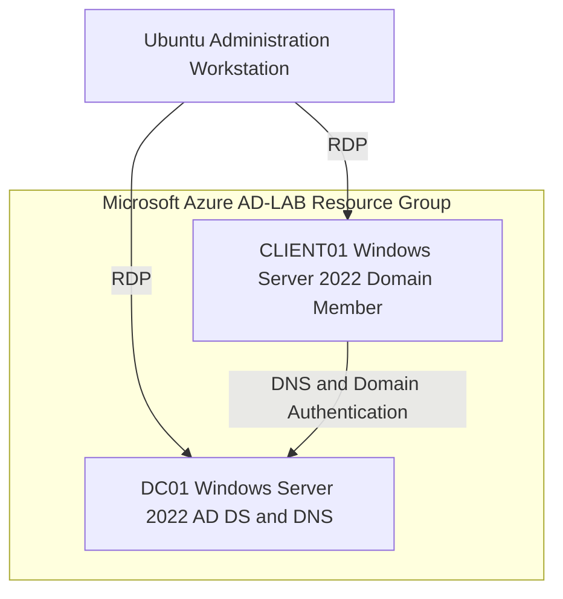
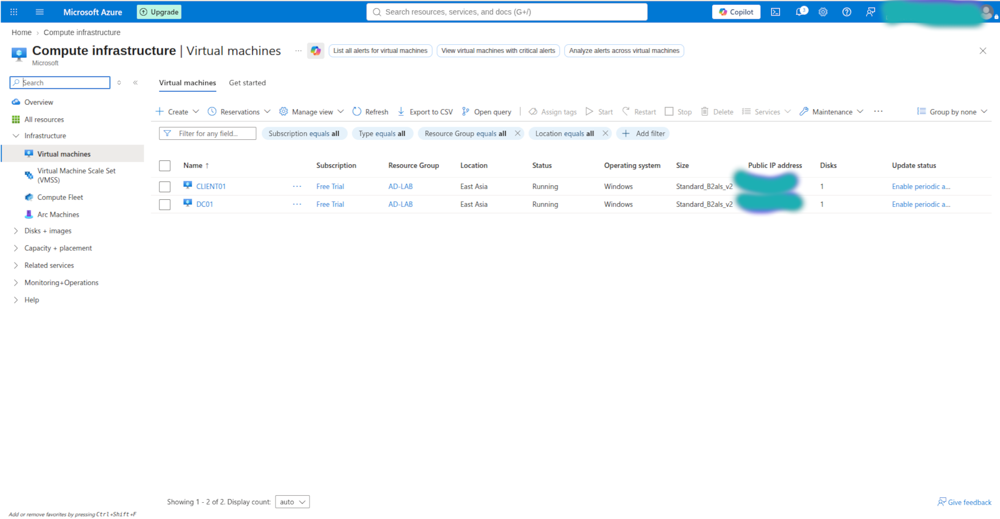
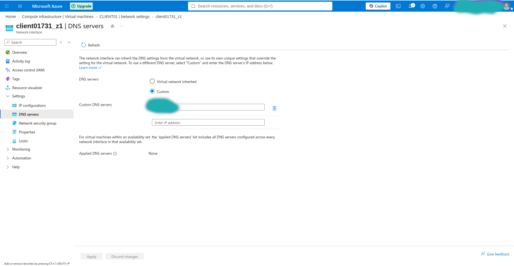
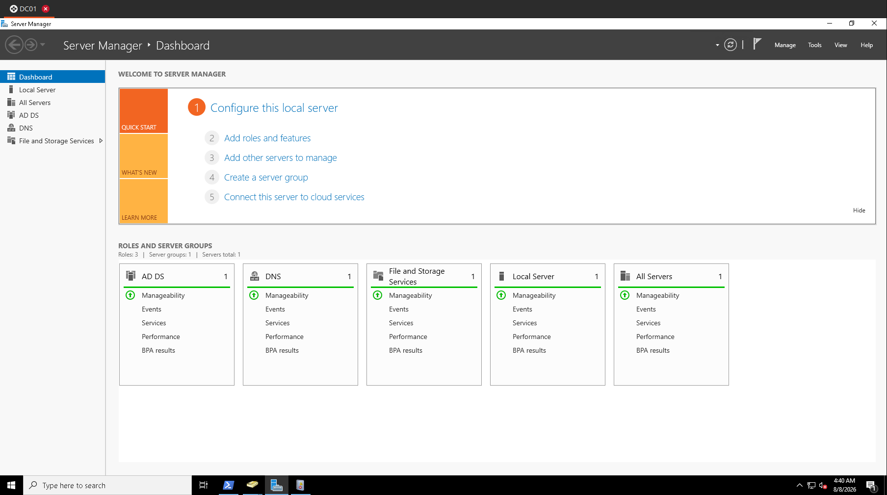
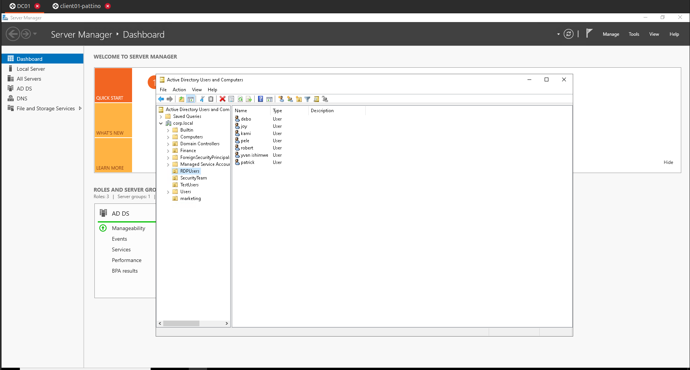
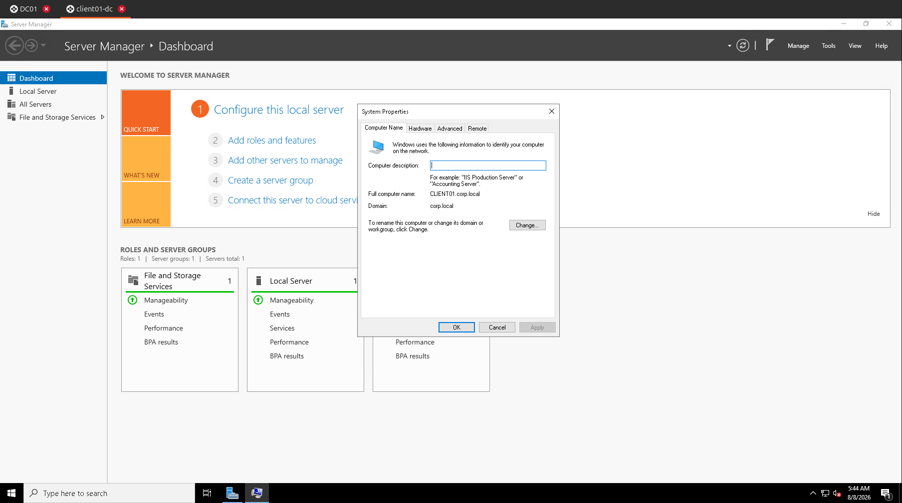
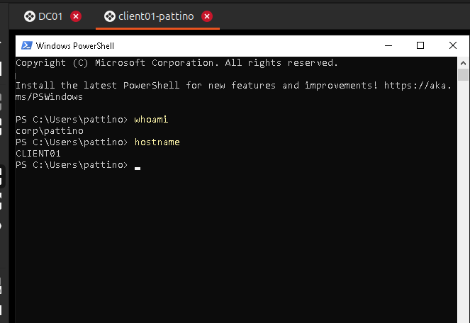

# Azure-Hosted Active Directory Domain Services Lab


## Executive Summary

This project documents the deployment of an Active Directory Domain Services (AD DS) lab in Microsoft Azure. The environment consists of a Windows Server 2022 domain controller and a second Windows Server 2022 virtual machine configured as a domain member.

The project demonstrates foundational skills in Azure networking, Windows Server administration, AD DS, DNS, domain authentication, identity management, Windows security-event analysis, cloud security posture review, remote administration, and systematic troubleshooting.

> This project uses traditional Active Directory Domain Services hosted on Azure virtual machines. It is separate from Microsoft Entra ID, formerly known as Azure Active Directory.

## Project Objectives

- Provision an isolated Active Directory lab in Microsoft Azure.
- Configure Azure virtual networking for communication between virtual machines.
- Install AD DS and DNS on a Windows Server 2022 virtual machine.
- Create a new Active Directory forest and domain named `corp.local`.
- Configure a second Windows Server 2022 VM as a domain member.
- Create and manage organizational units, domain users, and security groups.
- Validate local and domain authentication on the member server.
- Troubleshoot RDP, DNS, and domain-join failures.
- Review and correlate authentication, account-management, privilege, process, group, and scheduled-task events.
- Export Windows Security logs for offline analysis.
- Review Microsoft Defender for Cloud recommendations and Azure Network Security Group controls.
- Document security considerations and lessons learned.

## Architecture



## Environment

| Component | Purpose |
|---|---|
| Microsoft Azure | Cloud platform hosting the lab |
| `AD-LAB` resource group | Logical container for the project resources |
| Azure Virtual Network | Private communication between DC01 and CLIENT01 |
| DC01 | Windows Server 2022 domain controller and DNS server |
| CLIENT01 | Windows Server 2022 domain-joined member server |
| `corp.local` | Active Directory forest and DNS domain |
| Remmina | RDP client used from the Ubuntu administration workstation |
| Windows Event Viewer | Native review and filtering of Security logs |
| Microsoft Defender for Cloud | Cloud security posture recommendations |
| Azure Network Security Groups | Network traffic filtering and RDP exposure control |

## Implementation Overview

### 1. Azure foundation

- Created the `AD-LAB` resource group.
- Deployed an Azure virtual network and subnet for the lab machines.
- Deployed DC01 and CLIENT01 into the same virtual network.
- Used private addressing for communication between the two servers.

### 2. Domain controller deployment

- Deployed DC01 using Windows Server 2022.
- Configured DC01 with a stable private IP address.
- Installed the Active Directory Domain Services and DNS Server roles.
- Promoted DC01 as the first domain controller in a new forest.
- Created the `corp.local` domain.

### 3. Domain member deployment

- Deployed CLIENT01 using Windows Server 2022 Azure Edition.
- Configured CLIENT01 to use DC01's private IP address as its DNS server.
- Joined CLIENT01 to the `corp.local` domain.
- Restarted CLIENT01 to complete the domain-join process.

### 4. Identity and access administration

- Created organizational units to organize Active Directory objects.
- Provisioned and managed domain user accounts.
- Performed account enablement, disablement, password-reset, and deletion workflows.
- Managed security-group membership and reviewed the corresponding audit events.

### 5. Membership and authentication validation

The completed configuration was validated by confirming:

- CLIENT01 reports `corp.local` as its domain in Windows System Properties.
- A `CLIENT01` computer object exists in Active Directory Users and Computers.
- The original CLIENT01 local account can still authenticate locally.
- A `CORP` domain account can authenticate to CLIENT01.
- CLIENT01 can locate DC01 through Active Directory DNS records.

### 6. Security monitoring and cloud posture review

- Reviewed the Windows Security log on DC01 through Event Viewer.
- Filtered authentication, account-management, group-management, privilege, process, and scheduled-task events.
- Correlated recorded events with actions performed in the lab.
- Exported the DC01 Security log as `DC01-SecurityLogs.evtx` for offline analysis.
- Reviewed Microsoft Defender for Cloud recommendations for the Azure VMs.
- Examined Azure Network Security Group rules and RDP exposure.

## Troubleshooting Case Studies

### RDP file parsing failure on Ubuntu

**Symptom**

Remmina displayed the following error when an Azure-generated RDP file was opened:

```text
Could not find the address for the RDP server "(null)".
```

**Cause**

The imported RDP profile did not populate Remmina's server-hostname field correctly.

**Resolution**

A new Remmina connection profile was created manually using the VM's current connection address, the correct administrator username, and the RDP protocol.

### Active Directory domain controller could not be contacted

**Symptom**

CLIENT01 failed to join `corp.local`. The diagnostic message showed that the DNS query for the following AD SRV record timed out:

```text
_ldap._tcp.dc._msdcs.corp.local
```

**Cause**

CLIENT01 was not using DC01 as its DNS server, so it could not discover an Active Directory domain controller for `corp.local`.

**Resolution**

- Configured Azure DNS settings so CLIENT01 used DC01's private IP address.
- Ensured that DC01 and CLIENT01 were connected to the same virtual network.
- Restarted CLIENT01 so the updated DNS configuration was applied.
- Repeated the domain join and successfully completed it.

### Local account versus domain account

Windows displayed different identity formats depending on the account used:

```text
CLIENT01\local-user
CORP\domain-user
```

The first format identifies an account stored locally on CLIENT01. The second identifies an account stored in the `CORP` Active Directory domain. Domain membership does not automatically remove or disable existing local accounts.

## Security Monitoring and Event Correlation

Security events were reviewed under:

```text
Event Viewer > Windows Logs > Security
```

The lab used Event Viewer's **Filter Current Log** feature to identify relevant Windows Security events. Event availability depends on the action performed, the system on which it occurred, and the enabled audit-policy subcategories.

### Events reviewed

| Category | Event IDs | Security interpretation |
|---|---|---|
| Authentication | `4624`, `4625` | Successful and failed logons |
| Explicit credentials | `4648` | A process attempted a logon using explicitly supplied credentials |
| Privileged logon | `4672` | Special privileges were assigned to a new logon |
| Group membership at logon | `4627` | Group membership information recorded for a logon |
| Process creation | `4688` | A new process was created |
| Scheduled task | `4702` | A scheduled task was updated |
| User lifecycle | `4720`, `4722`, `4725`, `4726` | User created, enabled, disabled, or deleted |
| Password activity | `4723`, `4724` | Password change attempt or administrator password reset attempt |
| Local security groups | `4732`, `4733`, `4735` | Member added, member removed, or group changed |
| Global security groups | `4728`, `4729`, `4737` | Member added, member removed, or group changed |
| Universal security groups | `4756`, `4757`, `4755` | Member added, member removed, or group changed |

Group-management event IDs depend on the Active Directory group scope. Events `4732`, `4733`, and `4735` specifically describe security-enabled local groups; global and universal groups use the separate event IDs shown above.

### Correlation examples

| Lab action | Expected event |
|---|---|
| Successful account logon | `4624` |
| Failed account logon | `4625` |
| Administrator password reset | `4724` |
| User account creation | `4720` |
| Special privileges assigned at logon | `4672` |
| Process creation | `4688` |
| Scheduled task updated | `4702` |

The exported `.evtx` file is retained as private lab evidence and is not published in this repository because raw Windows logs can contain usernames, SIDs, IP addresses, computer names, and other internal metadata.

## Security Considerations

- Public IP addresses, credentials, subscription identifiers, and tenant identifiers are intentionally excluded from this repository.
- DC01 uses a stable private IP because domain members depend on it for DNS.
- CLIENT01 uses the internal AD DNS service instead of a public DNS resolver for domain discovery.
- Azure Network Security Group rules were reviewed to identify and reduce unnecessary RDP exposure.
- RDP access should be restricted to a trusted source IP rather than the entire internet.
- Microsoft Defender for Cloud recommendations were reviewed to identify VM and cloud-configuration risks.
- In a production design, domain controllers should not be directly exposed to the public internet. Azure Bastion, a VPN, or another secured management path should be used.
- Administrative accounts should be separated from standard user accounts and used only when elevated privileges are required.
- Azure VMs should be stopped and deallocated when the lab is not in use to control compute costs.

## SOC and Identity-Security Relevance

This lab provided hands-on experience with:

- Centralized authentication and authorization.
- Domain account and computer account lifecycle management.
- How clients locate domain controllers through DNS SRV records.
- The difference between local and domain security contexts.
- Filtering Windows Security events by Event ID.
- Correlating authentication, privilege, process, task, account-management, and group-management activity.
- Determining whether an expected event should be investigated on DC01 or CLIENT01.
- Exporting Windows Security logs for later analysis or SIEM ingestion.
- Reviewing cloud security recommendations and exposed management ports.
- How authentication, account-management, and domain activity support security monitoring and incident investigations.
- Why DNS and identity infrastructure are critical dependencies in an enterprise Windows environment.

## Skills Demonstrated

- Microsoft Azure virtual machines
- Azure resource groups and virtual networking
- Windows Server 2022 administration
- Active Directory Domain Services
- DNS configuration and troubleshooting
- Domain controller deployment
- Windows domain joining
- Organizational unit, user, and security-group administration
- Local and domain account authentication
- RDP administration with Remmina
- Windows Event Viewer and Security-log filtering
- Windows Security Event ID interpretation
- Security-event correlation
- Microsoft Defender for Cloud posture review
- Azure Network Security Group analysis
- Windows `.evtx` log export
- Technical troubleshooting and documentation
- Cloud cost awareness

## Lessons Learned

- Active Directory depends on correctly configured DNS; general internet connectivity is not enough for a domain join.
- Azure's local IP address is the VM's private IP address and should be used for internal AD communication.
- A domain-qualified username such as `CORP\user` prevents Windows from interpreting the account as a local user.
- Security events must be interpreted in context: the event source, logon type, initiating account, target account, and affected computer all matter.
- Group-management Event IDs vary with local, global, and universal group scope.
- Expected events may be absent when the corresponding audit subcategory is not enabled or the activity is inspected on the wrong system.
- Successful troubleshooting requires separating client-side application problems, Azure networking problems, Windows authentication problems, and DNS problems.
- Technical evidence should be sanitized before it is published publicly.

## Future Improvements

- Expand the OU design into departmental, server, workstation, and administrative tiers.
- Expand role-based security groups and test least-privilege access assignments.
- Deploy and document Group Policy Objects.
- Forward Windows security logs to Microsoft Sentinel, Splunk, or an ELK-based platform.
- Create detection rules and dashboards for failed logons, privileged logons, account changes, and group changes.
- Add Windows Event Forwarding for centralized collection without relying on manual exports.
- Remove direct public exposure and implement a secured administrative access path.
- Add infrastructure-as-code automation in a separate future version of the project.


## Evidence

### Azure Virtual Machines

The lab uses two Windows Server 2022 virtual machines hosted in Microsoft Azure: **DC01**, configured as the domain controller and DNS server, and **CLIENT01**, configured as the domain member.



*Figure 1: Sanitized Azure portal view showing DC01 and CLIENT01 running in the AD-LAB environment.*

### Client DNS Configuration

CLIENT01 was configured to use the private IP address of DC01 as its custom DNS server. This allowed the client to locate the Active Directory DNS records required to join `corp.local`.



*Figure 2: Sanitized CLIENT01 network-interface configuration showing the custom DNS setting.*


### Domain Controller Roles

DC01 was configured with the Active Directory Domain Services and DNS roles. Both services are operational and managed through Windows Server Manager.



*Figure 3: Server Manager showing the AD DS and DNS roles installed and operational on DC01.*

### Active Directory Organizational Structure

Organizational units and domain user accounts were created in Active Directory Users and Computers to simulate an enterprise identity-management structure.



*Figure 4: The corp.local domain containing organizational units and lab user accounts.*

### Domain Membership Verification

CLIENT01 was successfully joined to the `corp.local` Active Directory domain.



*Figure 5: Windows System Properties confirming that CLIENT01 is a member of corp.local.*

### Domain Authentication

Domain authentication was verified on CLIENT01 using a `corp.local` domain account.



*Figure 6: PowerShell verification showing a CORP domain identity authenticated on CLIENT01.*


### Additional Evidence

Additional sanitized evidence will document:

- Windows Security event monitoring.
- Microsoft Defender for Cloud recommendations.
- Network Security Group configuration.
- Troubleshooting and remediation activities.

> Raw `.evtx` files, RDP files, credentials, public IP addresses, subscription identifiers, and tenant identifiers are not published.

## References

- [Microsoft: Advanced Audit Policy Configuration](https://learn.microsoft.com/en-us/windows-server/identity/ad-ds/plan/security-best-practices/advanced-audit-policy-configuration)
- [Microsoft: Active Directory events to monitor](https://learn.microsoft.com/en-us/windows-server/identity/ad-ds/plan/appendix-l--events-to-monitor)
- [Microsoft: Audit Security Group Management](https://learn.microsoft.com/en-us/previous-versions/windows/it-pro/windows-10/security/threat-protection/auditing/audit-security-group-management)
- [Microsoft: Windows security event sets for Microsoft Sentinel](https://learn.microsoft.com/en-us/azure/sentinel/windows-security-event-id-reference)

## Disclaimer

This lab was created in an authorized personal Azure environment for educational and portfolio purposes. It does not contain real organizational data, production credentials, or unauthorized access activity.
